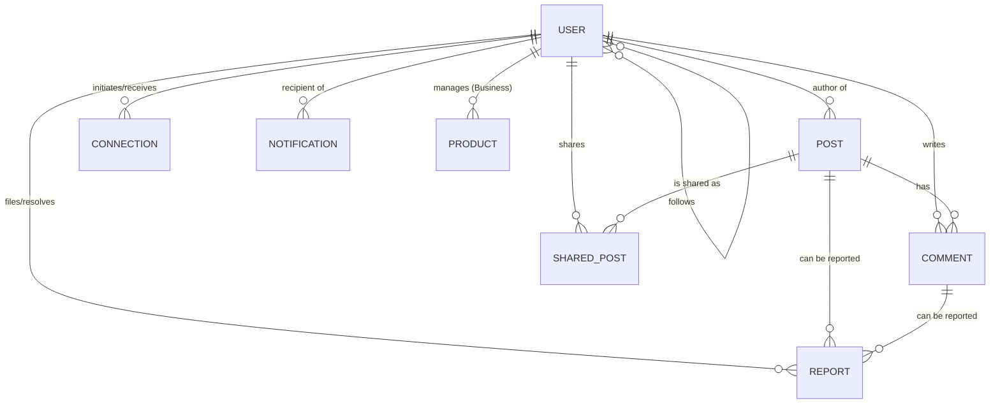

# Entity Relationship Diagram (ERD) - RevConnect

This document provides a detailed overview of the database schema and entity relationships within the RevConnect application.

## 📊 ER Diagram

## 📋 Entity Descriptions

| Entity | Description | Core Attributes |
| :--- | :--- | :--- |
| **User** | Central entity representing platform members. | `id`, `username`, `email`, `role`, `displayName`, `bio` |
| **Post** | Content created by users (Text, Images). | `id`, `content`, `author_id`, `createdAt`, `mediaUrl` |
| **Comment** | Responses to posts. | `id`, `content`, `author_id`, `post_id`, `createdAt` |
| **Connection** | Networking relationships (Follows/Requests). | `id`, `requester_id`, `receiver_id`, `status` |
| **Notification** | Real-time alerts for user activity. | `id`, `recipient_id`, `type`, `message`, `isRead` |
| **Product** | Items listed by Business users. | `id`, `name`, `description`, `price`, `business_id` |
| **Report** | Safety mechanism for flagging content/users. | `id`, `reporter_id`, `targetId`, `reason`, `status` |
| **SharedPost** | Tracking for posts shared by other users. | `id`, `originalPost_id`, `sharer_id`, `caption` |

## 🔗 Relationships Detail

1. **User - Post:** One-to-Many. A user can author multiple posts.
2. **Post - Comment:** One-to-Many. A post can have multiple comments.
3. **User - Connection:** Many-to-Many self-relationship managed via a join table or specific connection entities.
4. **User - Product:** One-to-Many. Only users with the `BUSINESS` role can manage products.
5. **Report System:** Polymorphic-like relationship where `targetId` refers to either a `Post`, `Comment`, or `User` based on the `ReportType`.

---
*Documentation generated for RevConnect 프로젝트.*
